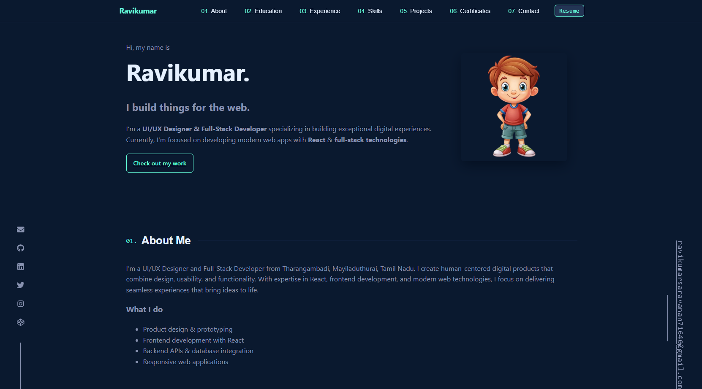
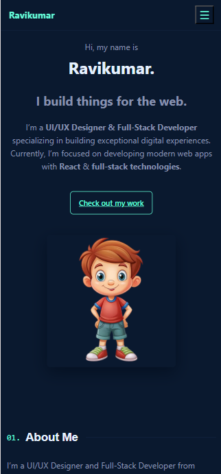

# 🌐 Personal Portfolio - Ravikumar

Welcome to my **personal portfolio website** built using **React + Vite + CSS**.  
It highlights my **skills, projects, certifications, and professional journey** as a **UI/UX Designer & Full-Stack Developer**.  

---

## ✨ Features
- Fully **responsive** design (Desktop 💻 | Tablet 📱 | Mobile 📲)
- Interactive **UI/UX** with smooth animations
- Organized sections:
  - Hero (Introduction)
  - About Me
  - Skills & Tools
  - Projects Showcase
  - Certifications
  - Experience
  - Contact
- Modern design with **React + CSS**
- Easy to deploy on **GitHub Pages / Vercel / Netlify**

---

## 📸 Preview

### 💻 Desktop View


### 📱 Mobile View


---

## 🛠️ Tech Stack
- **Framework:** React + Vite ⚡
- **Styling:** CSS 🎨
- **Icons:** React Icons 🔗
- **Version Control:** Git & GitHub 🐙
- **Deployment:** GitHub Pages / Netlify 🚀

---

### 📬 Contact Me

📧 **Email:** [ravikumarsaravanan71640@gmail.com](https://mail.google.com/mail/?view=cm&fs=1&to=ravikumarsaravanan71640@gmail.com&su=Freelance%20Opportunity&body=Hello%20Ravi,%0D%0A%0D%0AI%20would%20like%20to%20discuss%20a%20project%20with%20you.%0D%0A%0D%0AThanks.
)  

🔗 **LinkedIn:** [www.linkedin.com/in/ravikumar71640](https://www.linkedin.com/in/ravikumar71640)  

🐙 **GitHub:** [github.com/RavikumarSaravanan](https://github.com/RavikumarSaravanan)  


## ⭐ Support

If you like this project, please consider giving it a ⭐ on [GitHub](https://github.com/RavikumarSaravanan/portfolio-react) — it helps others discover it!

## ⚡ Getting Started

Clone the repository and run locally:

```bash
# Clone this repo
git clone https://github.com/RavikumarSaravanan/portfolio-react.git

# Navigate into project folder
cd portfolio-react

# Install dependencies
npm install

# Start development server
npm run dev


